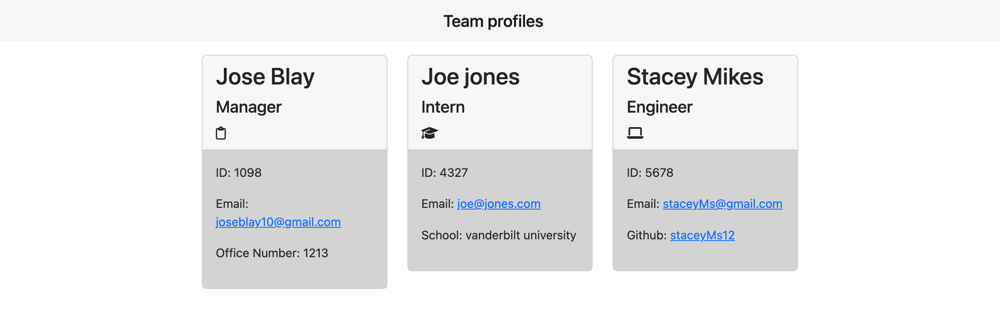

# TeamProf-Generator

The command line will ask you for information about you and your employees, which you may save on this page for easy access. The data will be included on employee cards and then shown on an automatically created HTML file. Each card will include links that may be clicked to the employee's email and your engineers' Github. 

[Demo Video](https://drive.google.com/file/d/1wd-77jMxkmRAE7TZ1Exh6IzoCqMCFshn/view)

## Table of Contents

- [Installation](#installation)
- [Screenshots](#screenshots)
- [Contact me](#contact-me)

## Installation

```
npm i
```
To start prompt questions:
```
node index.js
```

## Screenshots



## Contact Me
- Github: [JBlay10](https://github.com/JBlay10)
- Email: joseblay10@gmail.com


